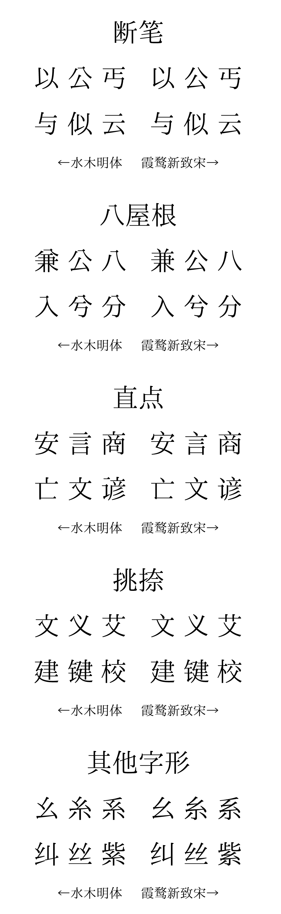

> [!IMPORTANT]
> 
> - 添字请在 [Issue #4](https://github.com/enderseven1/Mizuki-Ming/issues/4) 反馈，字形调整请在 [Issue #3](https://github.com/enderseven1/Mizuki-Ming/issues/3) 反馈，不要另开议题，以便于整理。**由于本人还是学生，要上学，v10.95 更新发布后，不会受理用户加字请求，中考后恢复受理，敬请谅解。**
> - 若需要在网站上使用这款字体，请下载woff/woff2版本，使用教程可自行上网搜寻。
> - 有关 Magisk 字体模块等手机字体替换有关的问题，我能力有限，我也不知道怎么解决，不要在本项目开议题。

# Mizuki Ming / 水木明体 / 水木明朝

A Chinese sans-serif font derived from IPAex Mincho and IPAmj Mincho. 「IPAex明朝」「IPAmj明朝」衍生中文字型。

[![猫啃网](https://shields.io/badge/%E7%8C%AB%E5%95%83%E7%BD%91-fe5e52?style=flat-square&logo=data:image/png;base64,iVBORw0KGgoAAAANSUhEUgAAACEAAAAfCAMAAABeSlSAAAAAAXNSR0IArs4c6QAAAARnQU1BAACxjwv8YQUAAAHyUExURQAAAAAA//8AAAAA//8AAAAA/wAA//8AAAAA//8AAAAA//8A//8AAAAA//8AAAAA//8AAAAA/wD///8AAAD/////AAD/////AP//AP//////AAD/////AAD/////AP///wD/////AP//AP//////AP//////AP///wD//////wD//wD/////////AP///wD//wD//wD/////AP///////////wD/////AP///wD///////////////////////////////////////////////////////////////////////////////////////////////////////////////////////////////////39/f39/f39/f39/f39/f39/f39/f39/f39/f39/f39/f39/f39/f39/f39/f39/f////39/f39/f39/f39/f39/f7+/v7+/v7+/v7+/v7+/v7+/v7+/v7+/v7+/v7+/v7+/v7+/v7+/v7+/v7+/v7+/v7+/v7+/v////7+/v7+/v7+/v7+/v7+/v7+/v7+/v7+/v7+/v7+/v7+/v7+/v7+/v7+/v7+/v7+/v7+/v7+/v7+/v7+/v7+/v7+/v////7+/v7+/v7+/v7+/v7+/v7+/v7+/v7+/v7+/v7+/v7+/v///y6UHskAAACldFJOUwADAwQEBQYGBwcICAkLCwwMDQ0NDhESEhMWFxgYGRkbHBwdHR8hIyQlJygpKSwsLS4yMjQ1Njc3ODk6PD5BQkNFRkdNUFFTVldaXF1fYGdqbnBxcnZ4eXt8gIGEhYaJio6RkpWXmJqbnJ2goqOlpqirrrCxs7S1trm7vr/BwsTHyMvMzc/Q0tPU2Nrb3N3f4uTm5+jp6+zt7vDx8vP19vf4+/z9/iyQxCoAAAAJcEhZcwAAFxEAABcRAcom8z8AAAHPSURBVDhPvZDpOxtRFIdvCJ1olaCLoqW1BF1U2tpJSlpFiK17NNE1DbGVoFVL20TRoMFUDDKS83+6Z+6tJjx9Hp+8X+b+fued88xcckLcmnl9nR8PkfVizoDPewHYcRYqVRQZr0TYfYinii0A2LReVOoDEiwrtN5txPNtMTj2B8BTH6OMGHc/A0huaduEoXg52FwwIEPY+7a1+opalV5uts/KEPp0s07aqkIj2wMv1XHmDbo0AqlTQ9rklRtoJI3DWLJ+MsxHf5mtFT7A98toCG/A9/jQBkR6/gNGzqJBLHu8O4pVrRgGiecjBJsUgeiWWPYNOtwBWk99dHlZs17KDO24Ep3nVHdMlV7ffaNRI/SEsPLkMENwYApUkUfb0K/XW0N7XTElv7GbSGZGghOTWBpno29dpT8PfWd0vxQjlRmJw8yItwPM52onAPq5MX3huIbw/n8GvzBC75+mzbJIo3iZVuFn7MIIKcIX5I7TEUZLkFb+ci6Q2G5cstrQC7CQf/4rgKtmEVfYNFwgJO0dXpAs0vbLKLXFHRrBfYmPkZQe3BpFyJXJhwxV/Tc+4fw0n+KjA+Ibhvx8CmvDjf8+IYprJsuTp+0P8ng8OQjZB5l3H1123DZyAAAAAElFTkSuQmCC)](https://www.maoken.com/freefonts/21352.html)
 
 

水木字型交流群：901505967

**不建议将其用于繁体字!**

## 项目介绍
2009 年，日本「独立行政法人情报处理推进机构」（IPA）将「IPA 明朝」和「IPA ゴシック」两款字型按照 IPA Font License 开源发布。这两款字型分别衍生自 TypeBank 公司出品的、由林隆男（Takao Hayashi）设计的[「TB 明朝」](https://www.typebank.co.jp/fontfamily/tbmincho/)和[「TB ゴシック」](https://www.typebank.co.jp/fontfamily/tbgothic/)。后经多年持续修订，两款字型扩充成[「IPAex 明朝」「IPAex ゴシック」](https://moji.or.jp/ipafont/)，包含 JIS 第一～第四水准的字符。而[「IPAmj 明朝」](https://moji.or.jp/mojikiban/font/)是对「IPAex 明朝」的进一步扩充，包含了「文字情报基盘」所涵盖的汉字及其诸多 IVD 变体。

本项目「水木明体」为「IPAex 明朝」[「霞鹜致宋」](https://github.com/lxgw/LxgwZhiSong)的衍生字体，在原有的字形基础上，将笔画和写法调整为中国大陆地区规范，但保留印刷体特征，如断笔、八屋根、挑捺（饰笔）等，将大陆宋体中的楷化部分去除，给您一个纯粹的印刷字体！

2023 年中，[「水木明体」](https://github.com/enderseven1/Mizuki-Ming)项目创建，以一点明体为基础，将字形改为大陆地区规范，并保留了印刷体特征。后来由于草字头汉字过多，便一直搁置，始终得不到完善。直至2024年2月中，我的电脑被砸毁，导致字体制作无法进行，五月十日，购入新电脑，便继续字体制作，制作速度也快多了。由于时间流逝，多种旧字形宋体一一涌现，其中便包括「霞鹜致宋」，我便以其CL版本基础上重制，舍弃原本使用一点明体的文件，并补充了一部分霞鹜致宋缺少的字。本项目致力于复原未被楷化的印刷体风格的字形。

## 总体介绍

## 收字情况
首次发布的「霞鹜致宋」收录「国际表意文字核心」（IICore）范围内的 [9810 个汉字](https://github.com/NightFurySL2001/CJK-character-count/blob/master/iicore-han.txt)。
> #### 何为 IICore？
> 「国际表意文字核心」（International Ideographs Core，IICore）是 CJK 统一表意文字编码的最小子集，包含了两岸四地、日本、南韩、北朝鲜等区域提交的总共 9810 个常用汉字，可用於记忆体容量和输入／输出资源有限的设备，以及／或那些不能使用整套 ISO/IEC 10646 表意文字字集的应用系统。IICore 包含 9706 个基本区汉字、42 个扩展 A 区汉字和 62 个扩展 B 区汉字，於 2003 年 IRG 第 21 次会议提出，2004 年 IRG 第 22 次会议通过。

目前「霞鹜致宋」包含 IICore 所收录的 9810 个常用汉字，以及原始授权字型「IPAex 明朝」所包含的 JIS 第 1～4 级别汉字，和[「jf 7000 当务字集」](https://justfont.com/jf7000)基本包所收字。而水木明体及其变体在此基础上补完了GB12345、GB2312等表。

## 获取字型
进入 [Releases](https://github.com/enderseven1/Mizuki-Ming/releases) 页面下载 TTF 格式字型档案。

## 授权资讯
- 本字型在 IPA 所开发并发布的 [IPAex明朝](https://moji.or.jp/ipafont/)、[IPAmj明朝](https://moji.or.jp/mojikiban/font/) 基础上衍生，依照 [IPA开放字型授权条款 第1.0版（IPA Font License 1.0）](https://opensource.org/licenses/IPA/) 授权。 使用本字型时，请遵从[「IPA开放字型授权条款 第1.0版」](LICENSE_CHT.md)（[IPA Font License 1.0](LICENSE.md#ipa-font-license-agreement-v10)， [IPAフォントライセンスv1.0](LICENSE.md)）之规定。
- 但凡有任何人使用、复制、修改、分发本字型，或对本字型进行任何符合 IPA Font License 1.0 规定的行为，使用、下载或行使合约规定权利之接受方，亦视为同意遵守 IPA Font License 1.0 的一切规定。
- 根据 IPA Font License 1.0 有关条款，后续衍生不可使用原始授权程序的名称（包括程式名、档案名、字型名），且须继承原有授权条款（故 IPA Font License 1.0 与 SIL OFL 1.1 不相容）。
- 有关 IPA Font License 1.0 的其他常见问题，请参阅 [FAQ（日语）](https://moji.or.jp/ipafont/faq/)，需自备翻译工具。
- 「IPA字型（IPA Font，IPAフォント）」为日本「独立行政法人情报处理推进机构」（简称「IPA」）的注册商标。

## 历史
在水木明体制作初期，曾作为一点明体的衍生物，由于一点明体字形与水木明体字形相差甚远，故一直得不到完善，后来以霞鹜致宋CL衍生，终于得以完善。

## 鸣谢名单
> 作者尊重每一位贡献者的成果，虽然本项目与遍黑体项目并无关联，但为了保险起见，被遍黑体列入黑名单的人员将**不会被公开展示**。
- 赞助商：FontCreator、供电局、展逸电脑等
- 变体版本：躁动、LXGW
- 总策划：岛田水木
- 字形提供：一点字坊、LXGW
- 其他字形建议：世缘哥（户、萨字）、躁动（改善部分笔画）

## 相关资料与工具
### 相关资料
- [原始授权字型 IPA Font](https://moji.or.jp/ipafont/)
- [秋空黑体](https://github.com/ChiuMing-Neko/ChiuKongGothic)
- [京华老宋体](https://zhuanlan.zhihu.com/p/637491623?utm_id=0)及[汇文明朝体](https://zhuanlan.zhihu.com/p/344103391)
- [IBM Plex Sans TC](https://github.com/IBM/plex)
- [台北黑体](https://sites.google.com/view/jtfoundry/)
- [香港民间字集](https://github.com/hfhchan/hkcs)
- [华英明朝](https://github.com/GuiWonder/HuayingMincho)
- [五月雨明朝（字客网）](https://m.fontke.com/font/25603163/)
- [康熙字典网上版](https://www.kangxizidian.com/)
- [筑地五号活字样本](https://www.asahi-net.or.jp/~sd5a-ucd/Tsukiji-5go-S11-Specimenbook.html)
- [一点字坊](https://github.com/ichitenfont/)[传承字形标准化文件](https://github.com/ichitenfont/inheritedglyphs)及[一点明体](https://github.com/ichitenfont/I.Ming)
- [共通中文界面](https://www.ccli.gov.hk/tc/iicore/)
- [书同文汉字网 IICore 两岸四地校对平台](https://hanzi.unihan.com.cn/IICoreExt)
- [IICore 字表（TXT 格式）](https://github.com/NightFurySL2001/CJK-character-count/blob/master/iicore-han.txt)
- [DWPI 明朝](https://www.digitalwidearea.org/dwpi_mincho)
### 相关工具
- [汉文博士](https://www.cnblogs.com/hanbox)
- [字统网](https://zi.tools/)
## 更多「水木」系列字型
- [水木黑体 / Mizuki Gothic](https://github.com/enderseven1/Mizuki-Gothic/)
- [水木明体变体 / Mizuki Ming Var](https://github.com/enderseven1/Mizuki-Ming-Var/)
## 「霞鹜」系列字型
### 与本项目有关联的字型
- [霞鹜致宋 / LXGW ZhiSong](https://github.com/lxgw/LxgwZhiSong)
- [霞鹜新致宋 / LXGW Neo ZhiSong](https://github.com/lxgw/LxgwNeoZhiSong)
### 「霞鹜文楷」系列
- [霞鹜文楷 TC / LXGW WenKai TC](https://github.com/lxgw/LxgwWenKaiTC)
- [霞鹜文楷 GB / LXGW WenKai GB](https://github.com/lxgw/LxgwWenKaiGB) | [Lite](https://github.com/lxgw/LxgwWenKaiGB-Lite)
- [霞鹜文楷 / LXGW WenKai](https://github.com/lxgw/LxgwWenKai) | [Lite](https://github.com/lxgw/LxgwWenKai-Lite)
### 其他
- [霞鶩晰黑 / LXGW XiHei](https://github.com/lxgw/LxgwXiHei)
- [霞鹜新晰黑 / LXGW Neo XiHei](https://github.com/lxgw/LxgwNeoXiHei)
- [霞鹜漫黑 / LXGW Marker Gothic](https://github.com/lxgw/LxgwMarkerGothic)
- [小赖字体 / Xiaolai](https://github.com/lxgw/kose-font)
- [悠哉字体 / Yozai](https://github.com/lxgw/yozai-font)
